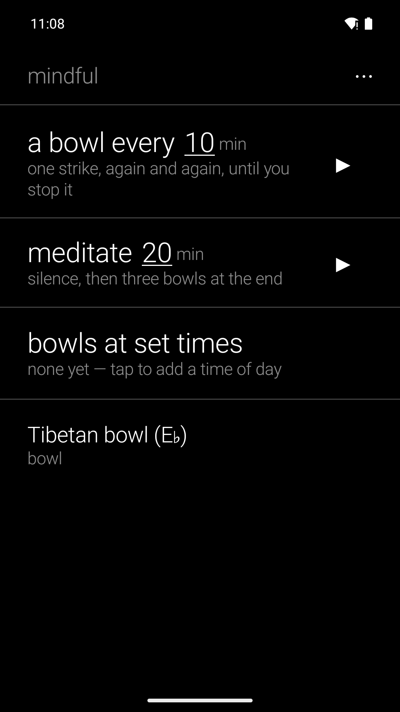
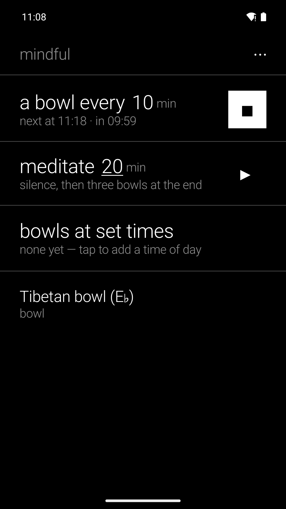

# Reader's Mindful Tool

Three things a meditator asks of a bowl: a strike every X minutes, a sitting of X minutes
closed by three bowls, bowls at set times each day. Rung as exact alarms, so they sound through
Doze and silent mode. Five bowls or your own file. No streaks, no guidance, no account. One of
the [Reader's](https://github.com/funkypitt/readers-launcher) apps, on the bell mechanics of
[Retreat Timer](https://github.com/funkypitt/retreat-timer) and
[Retreat Walk](https://github.com/funkypitt/retreat-walk).

## Key points

* A bowl every X minutes: one strike, until you stop it. Bowls are timed from the start of the
  session, so they never drift off the clock.
* Meditate X minutes: silence, then three bowls; a hairline shows how far the sit has come.
* Bowls at set times: every day at the times you choose, one strike or three.
* One bowl for everything, among five loudness-matched recordings — or your own mp3 or wav,
  played three times over for the three bowls. Tap a bowl in the settings to hear it.
* Rings on the alarm stream, through silent mode, Do-Not-Disturb and deep sleep; re-armed after
  a reboot, a time change or an update. The settings offer the battery exemption in one tap.
* Widget for any launcher (both functions or one): minus · minutes · plus · ▶, live countdown
  and ■ while it runs. Reader's Launcher tile "mindful": swipe between the two, tap the words
  to change the minutes.
* No network permission: nothing leaves the phone. Six languages.

More detail: [docs/NOTES.md](docs/NOTES.md).

## Install


[](https://gallaz.ch/eink/#readers-mindful)

- **F-Droid** (recommended, updates arrive by themselves): add the repository from [gallaz.ch/eink](https://gallaz.ch/eink/#fdroid), or the address `https://funkypitt.github.io/fdroid-repo/repo` in F-Droid.
- **Obtainium**: tap the badge on the phone, or add `https://github.com/funkypitt/readers-mindful` in Obtainium.
- **APK**: attached to the [latest release](../../releases/latest). No automatic updates.

All three deliver the same file, with the same signature.

## Build

```
export JAVA_HOME=/path/to/jdk-21
./gradlew assembleDebug
```

minSdk 26, targetSdk 34. Bell recordings in `app/src/main/res/raw` are those of Retreat Timer.

## Crédits / Credits

© 2026 Pierre Gallaz. Développé avec [Claude Code](https://claude.com/claude-code) (Anthropic).
Licence MIT, voir `LICENSE`.

© 2026 Pierre Gallaz. Developed with [Claude Code](https://claude.com/claude-code) (Anthropic).
MIT licence, see `LICENSE`.

## Captures d'écran

 
